# NewsReader实验报告
## 一、负责的项目职责
### 学号：16341015  姓名：任浩博
规划项目，布局样式设计，规划MMVV框架，调整项目结构，API拉取，数据库建立，挂起恢复，磁贴，推送后台定时任务。
## 二、开发环境
windows10  
Visual studio2017-(windows 10 Fall Creators Update(10.0;版本 16299））  
Template10 Hamburger
## 三、项目阐述
### 项目名称：News Reader
### 项目简介：
News Reader为用户提供了一个全面的新闻搜索接口，通过搜索自己感兴趣的关键词，你
可以在订阅你喜欢的内容并收藏你关注的新闻并保存，你可以在任何地方再次阅读他们。应用界面友好，功能丰富。
### 项目功能：
a)提供通过关键词搜索新闻的接口  
b)提供新闻的收藏与分享功能——App to app communication、Database  
c)提供44个新闻频道的订阅服务——Network accessing  
d)提供订阅新闻的筛选功能功能  
e)提供定时新闻推送服务  
f)动态磁贴，后台定时更新最新新闻——Live tiles  
g)通过网页的形式直接打开新闻源
h)支持程序的挂起与恢复——File management  
i)通过连接音乐API提供的背景音乐播放器——media player  
j)提供两种界面的主题，友好的界面设计——Adaptive UI、Data Bingding  
k)更多更酷的东西
### 项目亮点：
a)本次项目基于Template 10 Hamburger模板。在这基础上完成了超酷的界面设计  
b)严格参照了MVVM模式，通过整齐规划的文件结构与设计思路，在代码编写中将视图、方法、模型的完全分离，实现了
低耦合、可重组、分工开发的特点。  
c)在完成基础的页面布置后，对各种控件添加了动画与交互相应  
d)注册了后台任务。通过IBackgroundTask接口设计触发间隔为15分钟的磁贴更新任务，动态轮流显示最新的5条新闻，
通过ToastNottificationManager实现间隔15分钟的新闻推送，并为其设置了对应的提示音。  
e)在拉取网络服务的等待过程中，显示Busy页面  
f)完成了各个页面的挂起恢复、并支持新闻的保存于分享  
g)添加了置于menu的背景音乐播放器  
## 四、项目展示
### （一）文件结构
News Reader  
     |——背景任务 BackgroundTask  
     |——主项目 News_reader  
      |——Models (channel,Music,News)  
      |——ViewModels  
      |——Views  
      |——services  
        |——APIservices(新闻及音乐API接口的调用，封装)  
        |——BackgroundServices(在后台任务注册接口）  
        |——Converter(绑定值转换器）  
        |——Dtabase(数据库相关操作封装）  
        |——MusicServices(背景音乐操作封装）  
        |——SettingServices(控制应用相关设置，主题更换等）  
功能分模块设计：  
将每一个功能作为一个单独模块写在Services中，经由ViewModels层合理调用实现整个Application功能的协调
一致。  
Views路由  
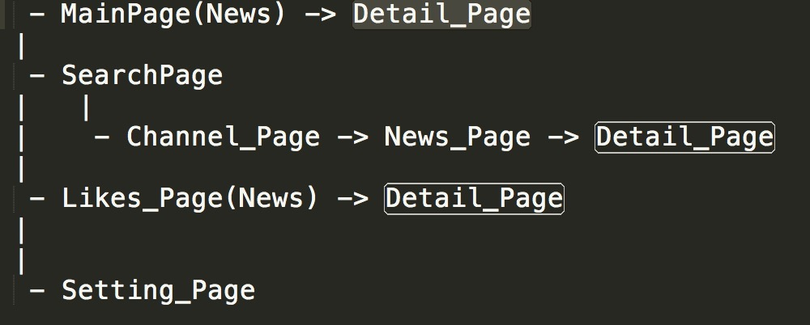  
按照MVVM模式设计，凡涉及数据模型的操作完全由Views通知ViewsModels操Models。只有少数不需要数据处理的操作的
由Views做处理。
### （二）HamburgerMenu
shell文件中，规范程序样式的框架，在此完成了对HamburgerMenu的设计：  
normal状态  
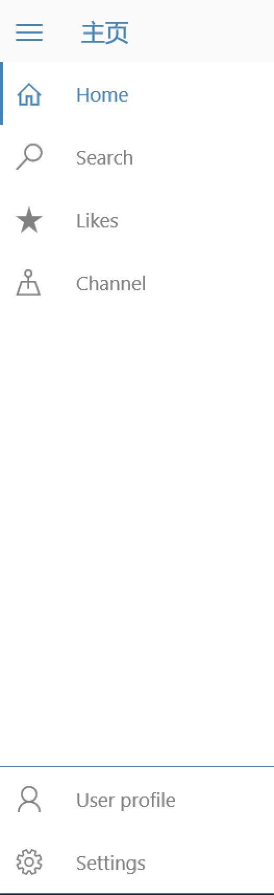  
wide状态  
  
  
### （三）主页面：（wide窗口下）
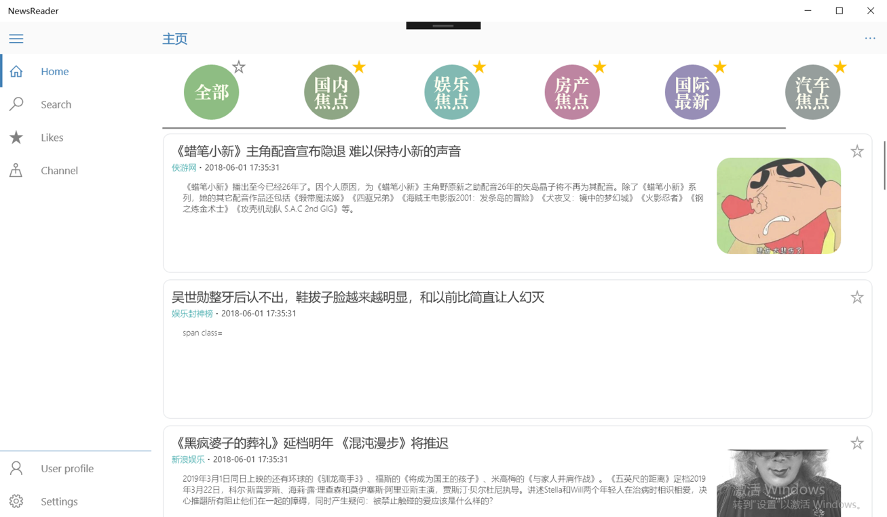  
主页面有两个部分组成  
横向的ChannelList  
纵向的NewsList  
ChannelList中展示用户已订阅的频道，点击其中的item可以在NewsList中显示当前的频道最新的20条内容  
### NewsList
NewsList中的item在宽版的窗口中，显示标题，详情，图片等等  
右上角的星星为收藏按钮，若为收藏，将显示黄星  
在正常的宽度，不显示图片  
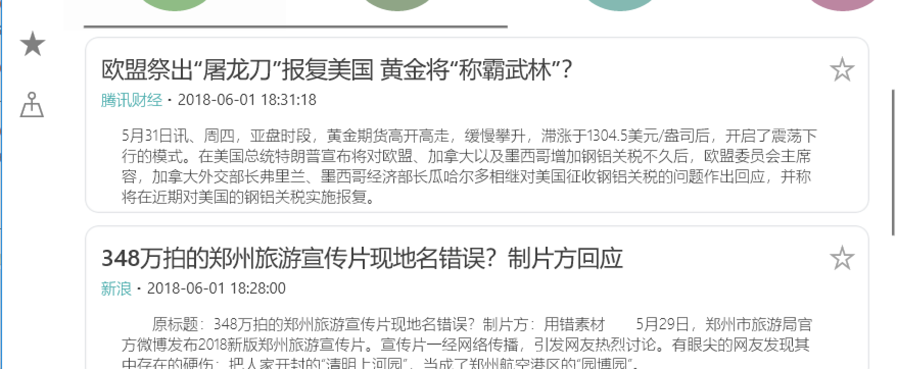  
在窄版的宽体中，只显示不显示详情（同事HamburgerMenu隐藏）  
  
### （五）Detail Page
点击NewsList中的Item，会跳转到相应的新闻网页  
NewsReader  
  
右上角的APPBarbutton提供更多功能  
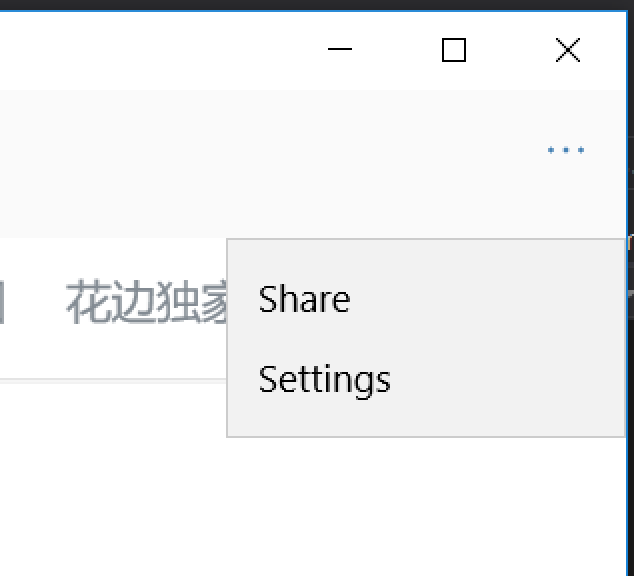  
### （六）分享功能
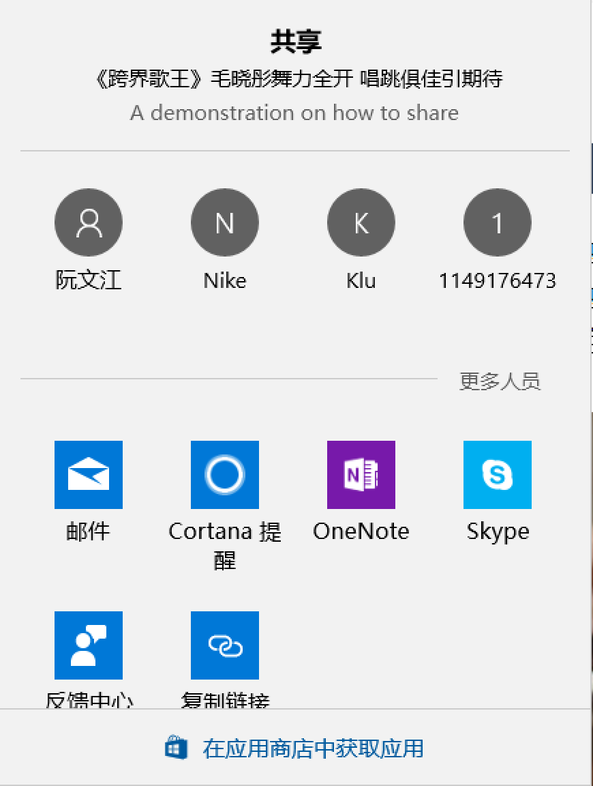  
邮件形式的分享  
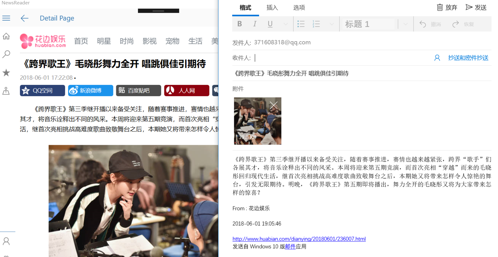  
### (七）search Page
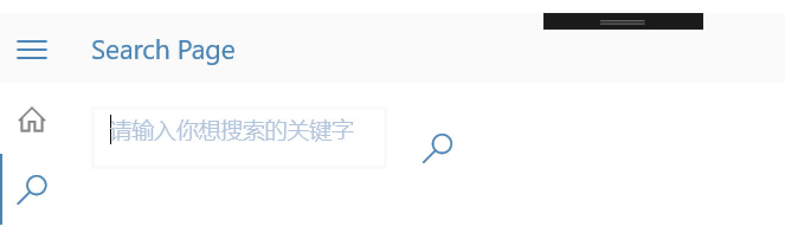  
跳转到NewsPage，显示关键词相对应的新闻（若关键词为空，则显示最新的新闻）  
### (八)Like Page
在这个页面，显示用户收藏的新闻  
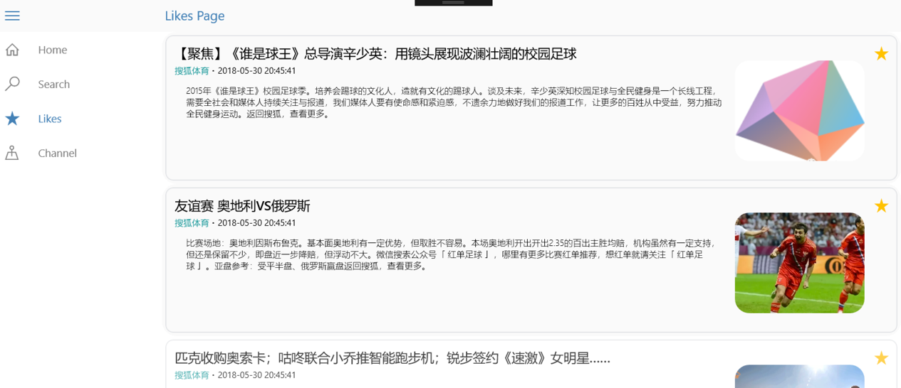  
### (九)channel page
在这个页面中，显示所有频道，具体的功能类似Main Page的Channel List  
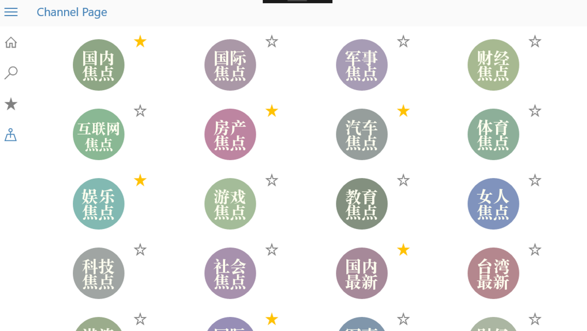  
### (十)背景音乐
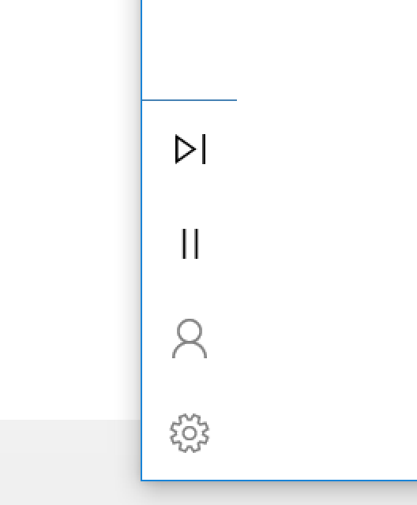  
在HamburgerMenu.SecondaryButtons添加背景音乐播放器，通过音乐APi拉取音乐，提供暂停与播放下一首的功能。  
### （十一）Busy Page
在进行API数据拉取和页面显示的加载过程中，显示Busy页面  
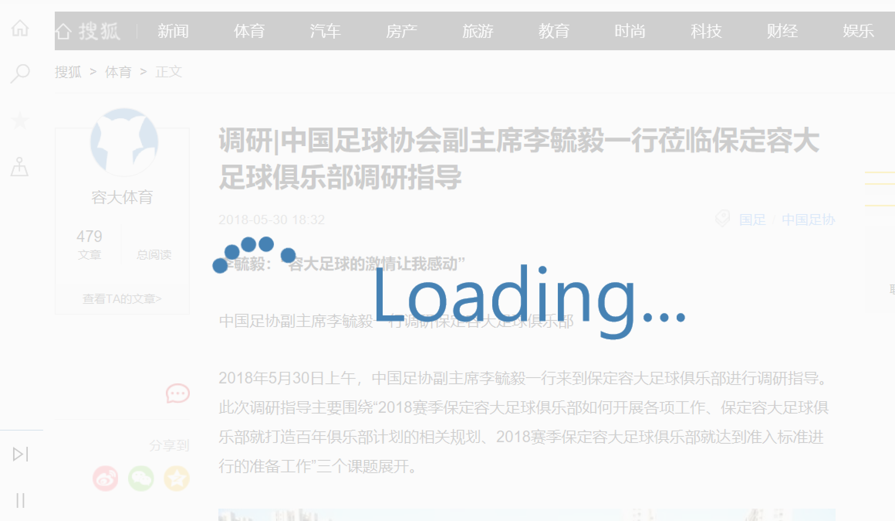  
### (十二）定时推送
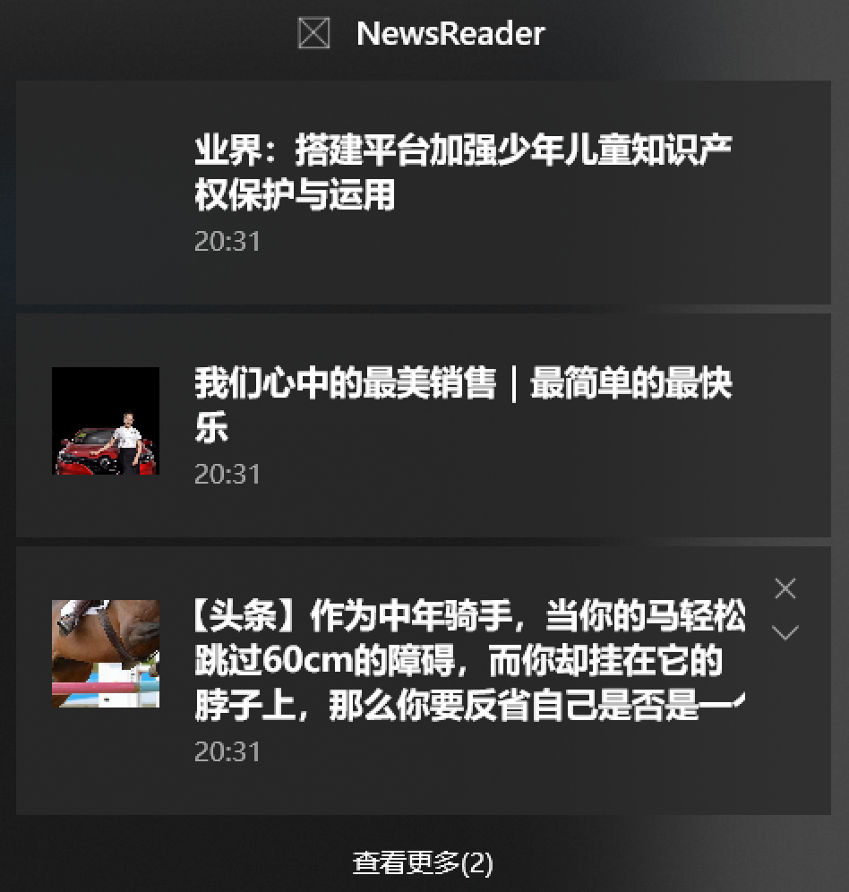  
### (十三）定时更新磁贴
  
### (十四）Setting Page
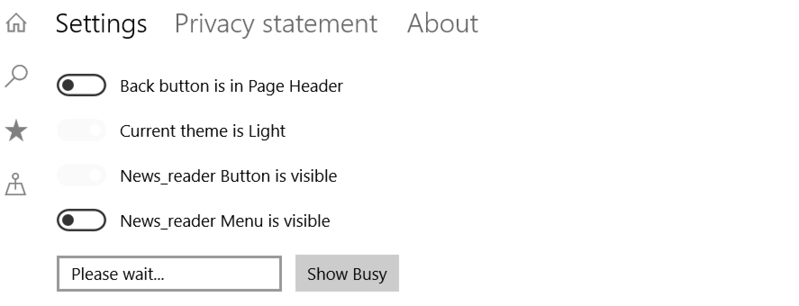  
## 五、项目难点及解决方案
### MVVM模式方面  
1.为了遵循MVVM模式我们放弃了⼀些简单直接的已知实现⽅式。例如 DataTemplate 中的click 事件绑定。由Datatemplate 中访问不到 ViewModel，我们以前接触过的的实现⽅式有两种  
(1)在 Views 中添加事件处理。  
但是这就要在 View 中对数据进⾏操作。这跟 MVVM 模式有冲突，也与整个项⽬的代码风格不太协调。  
(2)在 Model 中添加对应的⽅法。  
同样不符合 MVVM 模式。Model 应该由 ViewModel 来操作。并且 Model 作为数据模型，在其的⽅法中添加额外的功能也有些不伦不类。  
这两种⽅式不同层之间的耦合性⽐较强，不太适合团队实现，也不利于后期 Debug 以及升级。在
⽹上查过⼤量的资料后我找到了合适的实现⽅法利⽤ icommand 接⼜⾃定义实现绑定。  
之后又经过升级采⽤ DelegateCommand ⽤更简洁的⽅法重新实现绑定。  
2.关于绑定bool值与Visibility  
最初我们使⽤了 Binding 作为绑定没有做过多的处理。后修改为 x:Bind 后出现报错。开始时我们
并不能理解这⾥出错的原因，还以为是其他的错误。又经百度加⾕歌，⼤量查询，发现 Visibiility 并
⾮时 bool 类型。于是又该为弱类型绑定的 Binding,成功解决问题。  
  
### 功能方面
对新闻进⾏排序。该项⽬的新闻列表是通过 ObservableCollection 来实现的，原本它是⽆序的，⽽
在 Main Page 的“全部”频道的新闻进⾏更新时，需要按照⽇期对其进⾏排序。  
解决⽅案：ObservableCollection 这个类有 OrderBy 和 OrderByDescending 两个函数，可利⽤这两
个函数按照元素的某⼀属性进⾏升序和降序操作，不过操作完成后只能转为 List 类，需要根据排序好
的 List 类使⽤ Move 函数对 ObservableCollection 这个类再进⾏移动排序。  
  
### 样式方面
这次的项⽬中，在样式的修改上废了很⼤的劲。UWP 虽然提供了⾮常多的样式效果，但是实际
操作的过程中遇到了⽐较多的⿇烦。  
⾸先是 HamburgerMenu 的样式修改，因为不清楚 Template10 是如何设置控件 style，在⾃⼰摸索
了⾮常久的时间没有得到结果，后来通过 Google 和 Template10 在 Git 上的⽂档，得知在 Style ⽂件夹
中的 Custom.xaml ⽂件包含着各种⾃定义控件的初始样式，可以通过调⽤本地资源来设置样式。  
接下来就是 ListView 样式的设计，在⾃适应、点击事件、触摸事件的编写上，因为要修改的代码
量⾮常庞⼤，⼗分耗时⽽且常常达不到预期的效果，在官⽅⽂档中的说明并不清晰，常常陷⼊困境。
⽐如说 ListView 对窗体宽度的⾃适应，尽管代码正确，也⽆法实现功能，最后将需要改变的值绑定在
⼀个透明的 Grid 上，在宽度变化的时候改变这个 Grid 的属性来完成⾃适应的效果。  
另外还有 Button 的 PointerOver 事件、Press 事件的样式变化，也是通过查询⽹上的各种 demo 来
实现效果。  
  
### 后台任务的创建：
⼊⼜点的名称格式要求严格，写错后也不报错  
解决⽅法：通过在后台任务的触发⽅法 run 中添加断点，不断修改名称，发现必须设置为
LiveTileTask 的完整类名。  
  
### 动态磁贴的后台定时更新：
问题：因为 API 只能返回 jison，没有 xml，磁贴样式的 xml 从服务器获取⼗分困难。  
解决⽅法：先是寻找能将 json 直接转为 xml 的⽅法，尝试后发现⾏不通，最后通过 API 返回的
json 中获取需要的内容，⾃⼰创建⼀个 xml，将内容填⼊。每⼀次都重新创建 xml，在 Updater。  
  
### 通过API获取新闻时导致错误：
通过 API 获取到的新闻有些是没有对应属性的，⽐如，有些新闻是没有图⽚的，此时使⽤图⽚会
导致 OutOfRange 的错误；有时候获取新闻失败，返回的 JSON 数据不同导致错误。  
解决⽅案：在调⽤图⽚时需预先对该新闻进⾏判断以及处理；对于⽹络异常等导致新闻获取失败
的情况进⾏处理，防⽌错误的产⽣。  
  
## 六、项目总结
作为 News Reader 期中项目的组长，在项目接近尾声之际，回顾和组员一起没日没夜的 debug 的过
程，还是有不少体会的。  
首先是项目的初期，因为对项目内容的犹豫不决浪费了非常多的时间，导致我们在 5.23 号才创建项
目。但是现在想来，前期的讨论是有必要的，因为我们要做的是一款有实际应用的软件，而不是造一个各
种知识糅合却无真正用途的大杂烩。在细致的讨论了这个应用的使用方法、各个界面要显示什么内容、如
何交互、怎么布置才能显得更 Friendly…，经过一次次的更正和发展，才有了现在多层次的布局。  
在思考完具体功能、页面结构的基础上，我们毫不犹豫的采用了 MVVM 模式，加上老师之前课上向
我们的推荐过的 Template 10。然而在初期，我们发现 Template10 其实不是特别好理解，在没有阅读
Git 文档的基础下，初次使用的入门者难以使用这个模版的特性更别谈使用 MVVM 框架。经过长时间的
煎熬，在多次共同讨论之后，我们的项目终于有了严谨的遵从 MVVM 框架的文件和代码结构。  
这一点为我们后面的工作提供了很大的便利。利用 MVVM 框架低耦合的特点，我们可以较容易的读
懂其他队友的代码；再加上 MVVM 不同模块独立开发的优点，利用团队资源管理库的同步、拉取、推送、
更新等功能。四个人的同时作业完善各自的任务，项目的中期到结束，我们的进度一直很快。  
在完成项目的初步构造的基础上，NewReader 有了雏形，下一个阶段就是对其附加各种功能和亮点。
这一个阶段所用到的知识点基本都超出了课堂或作业涉及到的内容，所以非常感谢队友不辞辛劳的搜索、
阅读、学习，将计划中的功能一个个完成，例如后台任务、背景音乐任务、等待时的 Busy 页面…  
在最后阶段因为时间的限制，我们还是放弃了一点预期中的功能，最后的一段时间主要用于修改样式、
测试 Bug 和修复。  
虽然从开始着手项目到现在只有 8 天，但是在四个人彼此监督催促下，每天都能保持一定客观的进度，
到目前为止，虽然做出的效果没有百分之一百达到我们的预期，但是 NewReader 可以算是一件令我们较
为满意成品，而且在实用性、美观性、用户交互的便捷性等方面都达到了较为出色的程度，我相信如果日
后有时间在其基础上继续完善，可以成为一款比较优秀的软件  
最后附一张项目的commit图片：  
